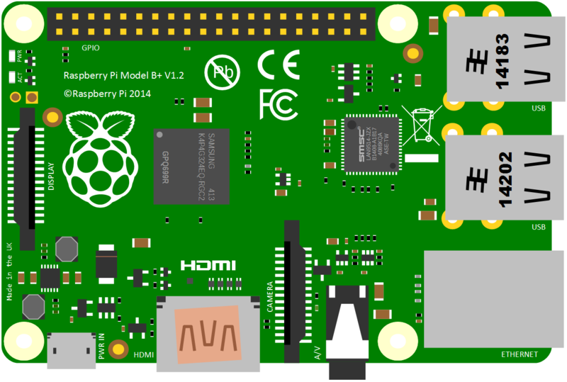
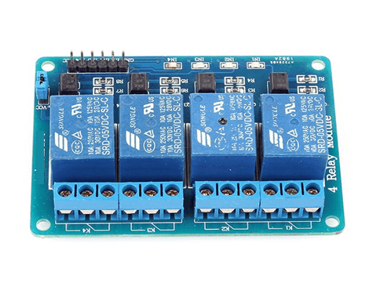

# Raspberry-Pi-Sonoff
It  is an Sonoff using Rapberry Pi


## Hardware Requirements:

#### 1.Raspberry Pi (Any Version Will Work)



#### 2.Relay Board




## Run
*Run Main.py File on RPI*

```
python main.py
```
*A Flask Server Will Run on http://0.0.0.0:8000/ Connect Relay With GPIO 2*

